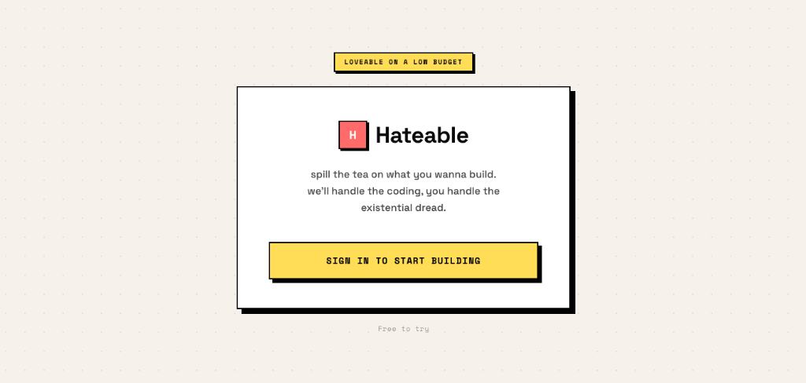

# hateable



> darling, i'm a nightmare dressed like a daydream.

welcome to hateable. it’s giving neo-brutalism, it’s giving zero-config sandboxes, and it’s giving “when did you get hot?” 

yap your dream app into existence and let the ai do the heavy lifting. we'll write the code, you just sit there, look pretty, and try not to disassociate. 

## the vibe ☕️
magic, madness, heaven, sin. 
we got a long list of ex-frameworks, they'll tell you we're insane. but we've got a blank space, baby, and we'll write your code. 

- **zero-config sandboxes:** literally just works. boots up faster than you can say *please please please* don't crash.
- **the aesthetic:** hard borders, sharp shadows, and loud colors. it's serving unbothered bad bitch energy.
- **ai-powered:** an ai assistant that actually gets it. no emojis, no cringe, just straight up shipping features while silently judging your tech stack. 

## running it (if you're brave)
it's gonna be forever, or it's gonna go down in flames.

you need docker desktop and skaffold. give it all your ram. don't be stingy.

```bash
skaffold dev
```

if it hits you with `insufficient memory`, that sounds like a you problem. close your 400 chrome tabs and try again. 

once it's up, head to localhost. that's that me espresso.

## architecture
it's a microservices stack because keeping it simple is boring.
- **router:** cherry-picks who gets in. 
- **auth:** google oauth so they can track your every move. love that for us.
- **sandbox-api:** spins up custom pods for your preview and terminal. we can make the bad pods good for a weekend.
- **sync-agent:** syncs your code with s3. currently pointing to ap-south-1 because having the wrong region was *such* a bad coincidence.

## license
MIT. steal it, copy it, whatever. i promise i won't hold a grudge (i will).
